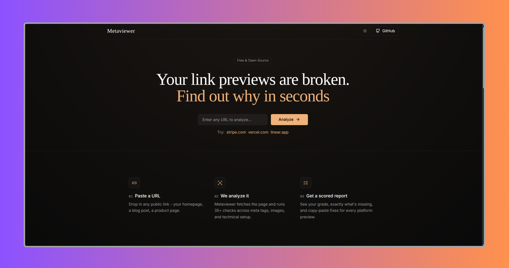

<p align="center">
  <a href="https://metaviewer.vercel.app/">
    
  </a>
</p>

<!-- Dark theme (will show when GitHub is in Dark mode) -->
[](https://metaviewer.vercel.app)

# Metaviewer

Metaviewer is a link-preview and meta-tag analyzer, in the spirit of
opengraph.xyz. Paste in any URL and get:

- A **0–100 score** (with an A–F grade) across 6 categories and 40+
  individual checks
- A live preview of how the link actually renders on **9 platforms** -
  Google, X, LinkedIn, Discord, Slack, WhatsApp, Telegram, Facebook, iMessage
- Real, **decoded image dimensions** for your OG image, favicon, and
  apple-touch-icon - not just whatever the page's meta tags claim
- A **copy-paste fix** for every failing or missing check
- JSON / CSV / raw-HTML / PNG **export**, and a shareable result URL
- **Local history** of every check, no account required

No sign-up, no database, no tracking.

## Tech stack

- **Next.js 14** (App Router) + **TypeScript**
- **Tailwind CSS**, CSS-variable based theming (dark/light, no flash on load)
- **cheerio** for server-side HTML parsing
- No animation/UI component libraries - everything is hand-built
- No image-decoding library - `lib/imageDimensions.ts` is a small,
  dependency-free binary parser for PNG/JPEG/GIF/WebP/BMP/ICO headers

## How it works

1. You submit a URL from the homepage and are immediately taken to a
   full-page loading screen (`app/analyzing/page.tsx`) that shows live
   progress (fetching → parsing → scoring) while the check runs, instead of
   sitting on the homepage.
2. The one server route, `app/api/analyze/route.ts`, fetches that page,
   parses it with cheerio, probes its images for real pixel dimensions, and
   scores it. This is the only server-side hop, and it exists only because
   browsers block cross-origin `fetch()` of arbitrary HTML - nothing is
   persisted on the server.
3. The result is saved to **your browser's `localStorage`**
   (`lib/localHistory.ts`) and rendered on `/results/[id]`.

Because persistence is entirely client-side, a `/results/[id]` link only
resolves in the browser that ran the check - sharing across devices would
require wiring up a real backend. `lib/localHistory.ts` is written as a set
of thin wrapper functions specifically so that swap (e.g. to Supabase) can
happen later without touching call sites.

## Project structure

```
app/
  page.tsx                     Homepage (URL form, features, FAQ)
  layout.tsx                    Root layout + theme init script
  globals.css                    Theme variables + animation keyframes
  analyzing/page.tsx               Full-page loading state while a check runs
  history/page.tsx                  Local check history (from localStorage)
  api/analyze/route.ts               Server fetch + parse + score, no persistence
  results/[id]/page.tsx                Results page - tabs, score card, actions

components/
  AnalyzeForm.tsx, SiteHeader.tsx, ThemeToggle.tsx, ExportMenu.tsx
  RecentAnalysis.tsx        Homepage "Recent Analysis" section (localStorage-backed,
                              hidden entirely until the visitor has run a check;
                              links out to the full /history page)
  ScoreRing.tsx, CategoryBars.tsx, StatusBadge.tsx
  PlatformPreviewCard.tsx   Single platform preview card, sized to its own content
  results/
    ResultTabs.tsx, StatusIcon.tsx, CodeFixBlock.tsx
    PreviewsTab.tsx           Pinterest-style masonry grid of all 9 platform cards
    BasicTab.tsx, OpenGraphTab.tsx, TwitterTab.tsx, ImagesTab.tsx,
    RawTab.tsx, ScoreTab.tsx

lib/
  extract.ts          Server-side fetch + cheerio parse. robots.txt check,
                        sitemap.xml check, security headers, HTTP
                        status/timing/server header, JSON-LD structured-data
                        detection, real image dimension probing (ranged GET +
                        lib/imageDimensions.ts), builds rawTags[].
  imageDimensions.ts    Dependency-free PNG/JPEG/GIF/WebP/BMP/ICO header
                          parser - reads a partial byte range, no full decode.
  analyzer.ts             CHECKS[] - single source of truth for scoring.
                            Attaches a fix string (lib/checkFixes.ts) to every
                            non-passing check.
  checkFixes.ts              One actionable fix string per check id.
  platforms.ts, platformPreview.ts
  localHistory.ts             THE persistence layer.
  exportResult.ts               JSON/CSV/HTML/PNG export functions.
  id.ts, timeAgo.ts

types/index.ts          All shared TypeScript types. Extend here first.
```

## Results page

Seven tabs, all reading from the same `AnalysisResult`, nothing mocked:
Previews, Basic, Open Graph, X/Twitter, Images, Raw, Score.

- **Previews tab** renders all 9 platform cards in a Pinterest-style masonry
  grid (CSS `columns` + `break-inside-avoid`). Each card sizes naturally to
  its own content instead of being clipped to a shared fixed height, and
  cards reflow cleanly when you switch the All / Search / Social /
  Messaging filter.
- **Score tab** shows a real, check-specific "How to fix" (from
  `lib/checkFixes.ts`) instead of repeating the check's own message.
- **Images tab** shows real decoded pixel dimensions for the OG image,
  favicon, and apple-touch-icon (via `lib/imageDimensions.ts`), with a note
  distinguishing "Decoded from image" vs. "From og:image:width/height" when
  a site declares dimensions that don't match what was actually fetched.
- **Basic tab** shows a Structured Data (JSON-LD) row with detected
  `@type`s, backed by the `structured-data` check in the Extras category.

## Getting started

```bash
npm install
npm run dev
```

Open [http://localhost:3000](http://localhost:3000).

## Build for production

```bash
npm run build
npm run start
```

Deploys cleanly to Vercel with zero configuration - it's a standard Next.js
14 App Router project with a single serverless API route and no environment
variables required. Verified locally with a clean `npm install && npm run
build` (Next.js 14.2.35, strict TypeScript, `noUncheckedIndexedAccess` on.

## Known gaps / good next tasks

- **No Accessibility or Performance scoring categories** yet - would need
  real checks (page-wide image alt-text audit, heading hierarchy, form
  labels, render-blocking resource detection).
- **Image dimension probing has limits.** JPEG SOF markers are found within
  the first 256KB fetched - true for the overwhelming majority of real
  photos/screenshots, but a JPEG with a huge embedded thumbnail/ICC profile
  ahead of the frame header could still come back "Unknown". Progressive
  JPEGs and animated WebP/GIF are read for their first frame's dimensions
  only (correct for previews either way).
- **Sharing across devices doesn't work** by design - see "How it works"
  above. This is the natural spot a real backend (Supabase or otherwise)
  would plug in: replace `lib/localHistory.ts` internals, keep the function
  signatures.
- **`lib/checkFixes.ts` fixes are static strings**, not generated from the
  actual extracted values (unlike the Open Graph/Twitter tabs' `CodeFixBlock`,
  which does fill in real values). Could be upgraded to interpolate the
  site's own URL/title/etc. into the fix text.

## Contributing / extending

1. Don't add a database or auth unless there's a real reason to.
2. New meta/technical fields flow in this order: `types/index.ts` →
   `lib/extract.ts` → `lib/analyzer.ts` (+ `lib/checkFixes.ts` if it's a
   scored check) → the relevant results tab component.
3. Never hardcode colors - use the theme tokens (`text-fg`, `bg-background`,
   `bg-surface`, `border-border`, `text-muted`, `text-accent`).
4. No new npm dependencies without a good reason - image dimension probing
   was deliberately hand-rolled instead of pulling in a library; keep that
   pattern unless something genuinely justifies a dependency.
5. Keep `lib/analyzer.ts` as the single scoring source of truth - tabs read
   `result.checks` / `result.categoryScores`, they never recompute pass/fail.

## Deploy

Deployed on Vercel. Push to your repo and import it in the Vercel dashboard - no config needed, it's a standard Vite app.

If you enjoyed this project, consider giving it a ⭐ on GitHub. It helps others discover the project and motivates future improvements.

# License (MIT)

This project is licensed under the MIT License.

```text
MIT License

Copyright (c) 2026 Bilal Malik

Permission is hereby granted, free of charge, to any person obtaining a copy
of this software and associated documentation files (the "Software"), to deal
in the Software without restriction, including without limitation the rights
to use, copy, modify, merge, publish, distribute, sublicense, and/or sell
copies of the Software, and to permit persons to whom the Software is
furnished to do so, subject to the following conditions:

The above copyright notice and this permission notice shall be included in all
copies or substantial portions of the Software.

THE SOFTWARE IS PROVIDED "AS IS", WITHOUT WARRANTY OF ANY KIND, EXPRESS OR
IMPLIED, INCLUDING BUT NOT LIMITED TO THE WARRANTIES OF MERCHANTABILITY,
FITNESS FOR A PARTICULAR PURPOSE AND NONINFRINGEMENT. IN NO EVENT SHALL THE
AUTHORS OR COPYRIGHT HOLDERS BE LIABLE FOR ANY CLAIM, DAMAGES OR OTHER
LIABILITY, WHETHER IN AN ACTION OF CONTRACT, TORT OR OTHERWISE, ARISING FROM,
OUT OF OR IN CONNECTION WITH THE SOFTWARE OR THE USE OR OTHER DEALINGS IN THE
SOFTWARE.
```

## Author


### Bilal Malik

[](https://x.com/bilalmlkdev)
[](https://github.com/byllzz)
[](https://bilalmlkdev.vercel.app)

**Metaview** | See what matters in your website, with clear, actionable insights.

© 2026 Metaview. All rights reserved.

